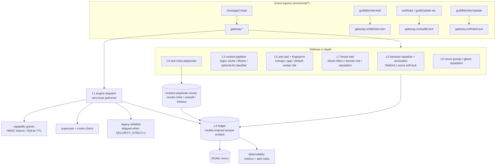

# Peace✘ Bot 🤖

A Discord bot with **moderation**, **server utility**, **security/anti-nuke**, and **owner tooling**, built with **discord.js v14** and a 10-layer zero-trust security platform (v2.0).

S — Spoofing:      Ed25519-signed cap tokens, no trust in memory
T — Tampering:     Hash-chained audit ledger, Merkle-root anchoring
R — Repudiation:   Every action tied to actor + signed log entry
I — Info Disclosure: Secrets AES-256-GCM, no PII in federated gossip
D — DoS:           Redis sliding-window, per-route REST buckets
E — Elevation:     Zero-trust capability middleware, TTL grants

> 🎵 **Music moved out.** All music commands now live in the separate **Peace music** bot
> (folder `Peace music`, its own token/application). This bot is security + regular use only.

## Features

### 👑 Bot ownership
`/owner list|add|remove` — the main owner (your `OWNER_ID` in `.env`) can grant **extra owners** the same powers. `/botinfo` shows public bot info only.

### 🛡️ Moderation
`/kick`, `/ban`, `/timeout`, `/untimeout`, `/purge`, `/warn`, `/warnings`, `/unwarn`

### 🛠️ Utility
`/avatar`, `/serverinfo`, `/userinfo`, `/roles`, `/role give|remove|list`, `/giverole`, `/roleicon`, `/nickname`, `/welcome`, `/goodbye`, `/lock`, `/unlock`, `/say`, `/poll`, `/remind`, `/ping`, `/stats`, `/help`, `/support`

### 🔐 Security platform (v2.0)
| Command | What it does |
| --- | --- |
| `/security` | Panel, incident audit, and capability verification |
| `/safety on/off` | Master kill-switch for the whole security platform |
| `/audit` | Tamper-evident ledger audit (per-guild + global) |
| `/incident list` | Open security incidents + rollback actions they took |
| `/gbans check/appeal` | Query across-guild gban reputation (Nexus) |
| `/security capability grant/revoke/list` | Issue scoped, expiring, signed capability tokens |
| `/whitelist` | Trusted users who bypass **all** filters (legacy, skipped in strict mode) |
| `/words` | Custom blocked-word filter |
| `/antilink` | Block all links except allow-listed domains + automatic scam-link blocking |
| `/antispam` | Auto-block message spam (configurable rate) |
| `/antinuke` | Detects rapid channel/role deletes or mass bans/kicks → auto **lockdown** |
| `/lockdown` | Manually lock every text channel (run again to lift) |

All security features are **automatic**:
- **Auto-warn** — rule breakers get warnings; at the threshold they are auto-timed-out.
- **Scam links** — common Discord-nitro / gift / freebie scam patterns are deleted instantly.
- **Custom word filter** — your own list of banned words/phrases.
- **Anti-nuke** — if someone nukes channels/roles or mass-bans, the bot locks the server, strips the attacker's roles and timeouts them.

## Security platform — architecture

Ten cooperating layers, all reachable through one façade (`client.security`, see `src/security/gateway.js`).
Every event funnels through `engine.dispatch(action, ctx)` so authorization, the tamper-evident ledger,
and the behavioral baseline always agree.



### Data flow

1. A moderator action (or message / join / role change) reaches the gateway.
2. **Layer 1** authorizes: superuser → crown (Administrator/ManageGuild) → capability grant → (legacy whitelist).
   On denial the **anti-nuke playbook** triggers.
3. Every accepted/denied decision is appended to the **Layer 4 ledger** (SQLite chain + merkle root + Ed25519 signature).
4. Content, joins, and audit flows are sampled into the **behavioral baseline** (UEBA) and the **content pipeline**.
5. Cross-guild reputation (scam senders, nukers, raid IPs) is exchanged via **nexus gossip** (L9) and feeds **Layer 7 intel**.
6. All signals surface as incidents with reversible rollback steps (role revoke, unaudit, timeout).

### Capability tokens

Signed capability tokens look like `shax2.<action>.<guild>.<principal>.<expiry>.<nonce>.<hmac>`.
They are issued via `/security capability grant`, stored in SQLite with a TTL, auto-swept
(`grant-sweep` scheduler), and **automatically revoked when the role is lost** (`onRoleChange`).
Verify with `/security verify` — the ledger chain is checked in the same call.

### Threat model (STRIDE)

| Threat | Mitigating layer |
| --- | --- |
| **S**poofing (assuming someone else's identity) | Signed capability tokens, HMAC-verified; actor resolution from audit logs |
| **T**ampering (modifying logs/decisions) | Merkle-chained ledger (L4), Ed25519 daily signatures, JSONL mirror sink |
| **R**epudiation (denying an action) | Every dispatch decision + incident step is ledger-appended with actor identity |
| **I**nformation disclosure | AES-256-GCM secrets store, no tokens/secrets logged, DM-redacted panels |
| **D**enial of service (raids, spam, nuke) | Anti-raid fingerprint + sliding window, rate limits (Redis if present), anti-nuke lockdown, UEBA soft-lock |
| **E**levation of privilege (privilege escalation) | Zero-trust authorize: crown check + grants + whitelist in a strict funnel; separation of *mediate* vs *destructive* capabilities |

Additional hardening: LMDB-style 0600 key files (fail-closed if world-readable), graceful degradation
on Redis/AI/feeds (platform never crashes the bot), deterministic migrations (v1–v8) applied transactionally.

## Incident runbook

Incidents (e.g. `nuke-…`, `raid-…`) are created by the playbook runner, appended to the ledger, and surfaced
as buttons on `/incident list` and via the audit log.

1. **Detect** — `/incident list` shows open incidents; the audit log is mirrored to a kill-switch channel on `alert-rules` triggers.
2. **Contain** — every launched playbook already applied containment (role revoke, timeout, lockdown).
   Opening an incident button re-runs/re-verifies containment idempotently.
3. **Rollback** — `/incident rollback` replays reversible steps (e.g. `unaudit` for bans/kicks) from the playbook's rollback plan.
4. **Verify** — `/security verify` (or `/incident verify`) clears UEBA soft-locks after a human + reaction check.
5. **Appeal** — `/gbans appeal` files an appeal; Nexus reputation is re-scored before any cross-guild ban persists.

## Setup

### Requirements

- **Node.js 18+** (https://nodejs.org) — 20+ recommended
- No **ffmpeg** needed for this bot (music lives in the Peace music bot).

### Quick start

```bash
npm install
cp .env.example .env            # add DISCORD_TOKEN, CLIENT_ID, OWNER_ID
npm run deploy                  # register slash commands
npm start
```

Grant the bot **Administrator** privileges and the `SERVER MEMBERS INTENT` / `MESSAGE CONTENT INTENT`
privileged intents. `DEV_GUILD_ID` is optional (recommended while testing for instant command deployment).

### Security environment (all optional)

```env
SECURITY_HMAC_SECRET=change-me   # else self-provisioned data/security.hmac (0600)
SECURITY_ED25519_KEY=...#        # else self-provisioned data/security.sigkey.ed25519
SECURITY_DB_PATH=./data/security.db
SECURITY_MIRROR_DIR=./data/mirror # JSONL tamper mirror
SECURITY_STRICT=1                 # skip legacy whitelist entirely
SECURITY_AI_LOCAL=1               # load the optional local AI classifier
SECURITY_METRICS_PORT=9100        # prometheus endpoint (0 = disabled)
```

### Testing

```bash
npm test            # vitest: engine + behavior/UEBA + ledger
npm run test:coverage   # coverage gates (80% lines/stmts/funcs, 70% branches)
npm run audit:deps      # dependency + registry security scan
```

## Project structure

```
src/
├── index.js              # Bot entry point, client setup, security bootstrap, shutdown
├── commands/
│   ├── moderation/       # kick, ban, timeout, purge, warn, warnings, unwarn
│   ├── owner/            # owner mgmt, moderation, voice/channel, roles, extras
│   ├── security/         # security, safety, audit, incident, gbans, whitelist, antinuke...
│   └── utility/          # avatar, poll, reminder, say, stats, role, welcome, goodbye...
├── events/               # interactionCreate, guildMemberAdd/Remove, messageCreate, antiNuke
├── security/             # the 10-layer platform (engine, gateway, ledger, behavior, playbooks…)
└── utils/                # helpers, settings store, security checks, stats counters
```

Settings are persisted in `data/settings.json`; the security ledger lives in `data/security.db` (WAL),
with the signed merkle root and daily signature alongside it.

## Hardening / production

- **Docker / compose** — see `Dockerfile`, `docker-compose.yml`, and `seccomp` profile in `deploy/`.
- **systemd** — see `deploy/peacex-bot.service` for a `NoNewPrivileges=yes`, `PrivateTmp=yes` unit
  (hardened resource + filesystem sandbox).
- **CI** — `.github/workflows/ci.yml` runs lint + tests + coverage + SBOM generation + `npm audit`.